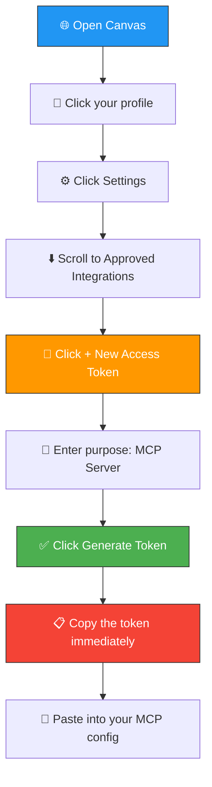

# How to Get Your Canvas API Token

A step-by-step guide to generating a personal access token for Canvas LMS.

> **⏱ Time needed:** 2 minutes
>
> **What you'll need:** A Canvas account (the one you use for your courses)

---

## Step-by-Step

### Step 1: Open Canvas and go to Settings

1. Go to your Canvas website (e.g. `https://learn.mywhitecliffe.com`)
2. Log in with your student account
3. Click on your **profile picture** (or initials) in the top-left sidebar
4. Click **Settings**

```
Canvas sidebar:
┌──────────────────┐
│ 🏠 Dashboard     │
│ 📚 Courses       │
│ 📅 Calendar      │
│ 📥 Inbox         │
│ ...              │
│                  │
│ 👤 [Your Name] ◀─── Click here
│    └─ Settings ◀─── Then click this
└──────────────────┘
```

---

### Step 2: Scroll down to "Approved Integrations"

On the Settings page, scroll all the way down. You'll see a section called **Approved Integrations**.

```
Settings Page:
┌────────────────────────────────────────────┐
│ Full Name: John Smith                      │
│ Email: john@university.edu                 │
│ Language: English                          │
│ Time Zone: (UTC+13:00) Auckland            │
│                                            │
│  ... scroll down ...                       │
│                                            │
│ ┌────────────────────────────────────────┐ │
│ │ 🔑 Approved Integrations              │ │
│ │                                        │ │
│ │ [+ New Access Token] ◀── Click this    │ │
│ └────────────────────────────────────────┘ │
└────────────────────────────────────────────┘
```

---

### Step 3: Click "+ New Access Token"

A popup will appear asking for two things:

| Field | What to enter |
|-------|--------------|
| **Purpose** | Type something like `MCP Server` or `AI Assistant` |
| **Expires** | Leave blank for no expiry, or pick a date |

```
┌─────────────────────────────────────────┐
│  Generate Access Token                  │
│                                         │
│  Purpose:  [MCP Server          ]       │
│  Expires:  [                    ]       │
│                                         │
│            [Cancel]  [Generate Token]   │
│                       ▲                 │
│                       └── Click this    │
└─────────────────────────────────────────┘
```

---

### Step 4: Copy your token

A new popup will show your **access token**. It looks something like:

```
12345~aBcDeFgHiJkLmNoPqRsTuVwXyZ1234567890abc
```

> ⚠️ **IMPORTANT: Copy this token NOW!**
>
> Canvas will only show it **once**. If you close this popup without copying it, you'll need to generate a new one.

---

### Step 5: Use your token

Now you have your token! Add it to your MCP client config:

```json
{
  "mcpServers": {
    "canvas": {
      "command": "node",
      "args": ["/path/to/canvas-mcp/dist/standalone.js"],
      "env": {
        "CANVAS_API_KEY": "paste-your-token-here",
        "CANVAS_BASE_URL": "https://your-canvas-url.edu"
      }
    }
  }
}
```

Replace:
- `paste-your-token-here` → the token you just copied
- `https://your-canvas-url.edu` → your Canvas website URL (e.g. `https://learn.mywhitecliffe.com`)

---

## Visual Flow



---

## Common Questions

### "What's my Canvas URL?"

It's the website you use to check your courses. For example:
- Whitecliffe: `https://learn.mywhitecliffe.com`
- Generic Canvas: `https://canvas.instructure.com`
- Your university might have a custom URL — check with your IT department

### "I lost my token!"

No problem. Go back to **Settings → Approved Integrations** and click **+ New Access Token** again. You can generate as many as you need.

### "Is my token safe?"

Your token is like a password. With this MCP server, it stays on your machine and is only sent to your Canvas instance. Never share it publicly or commit it to GitHub.

### "What permissions does the token have?"

It has the same access as your student account — it can view your courses, assignments, grades, etc. It **cannot** change anything about your account or other students' data.
